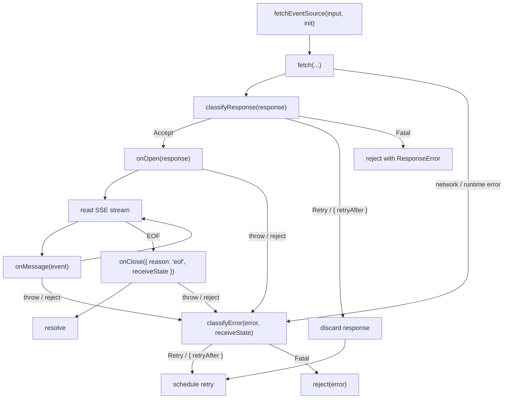
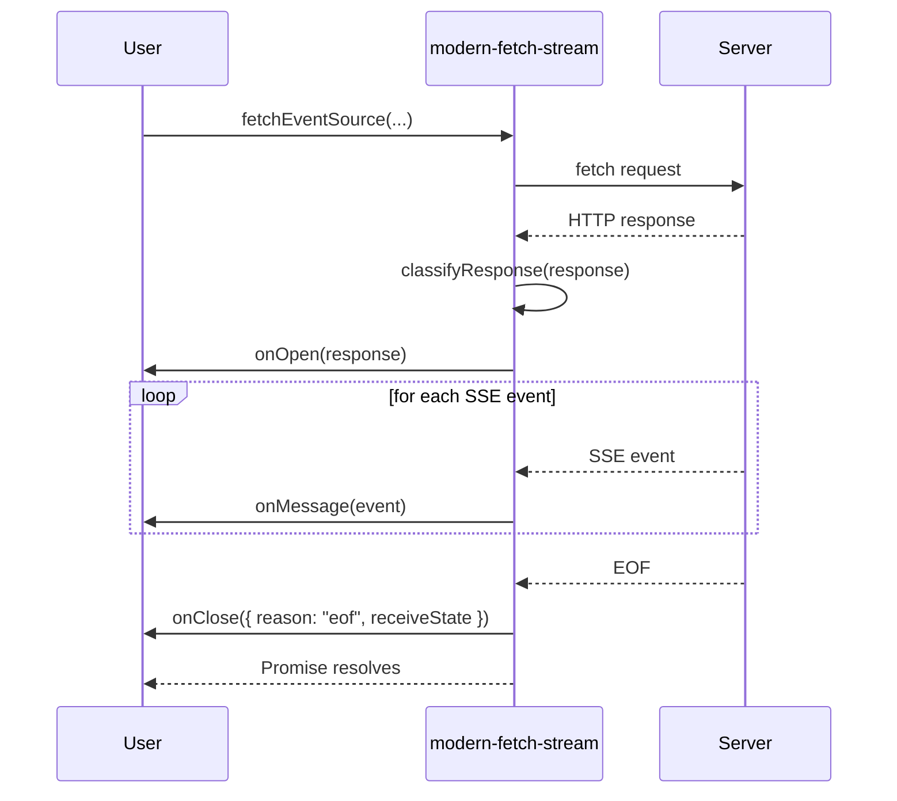
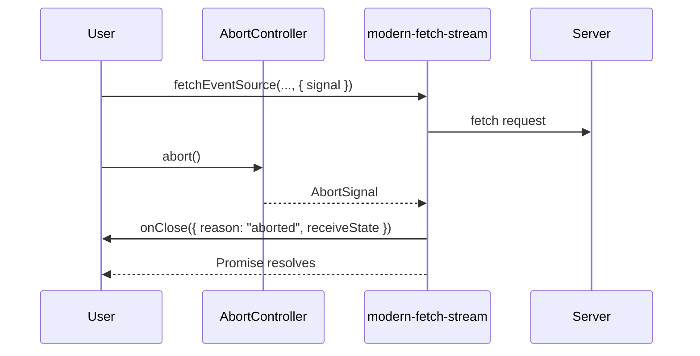
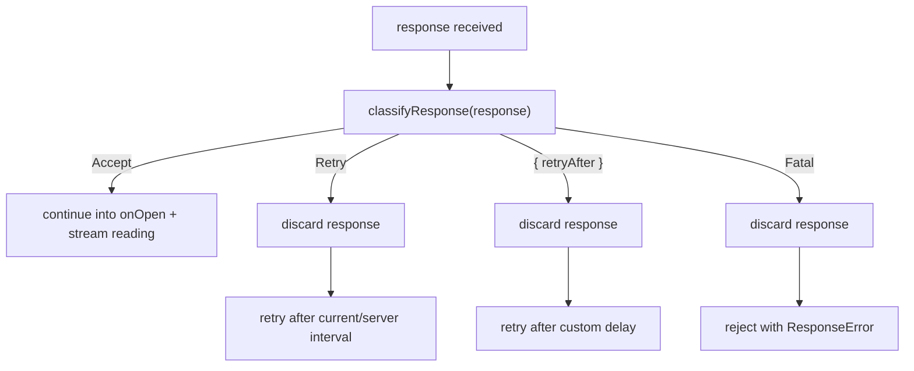
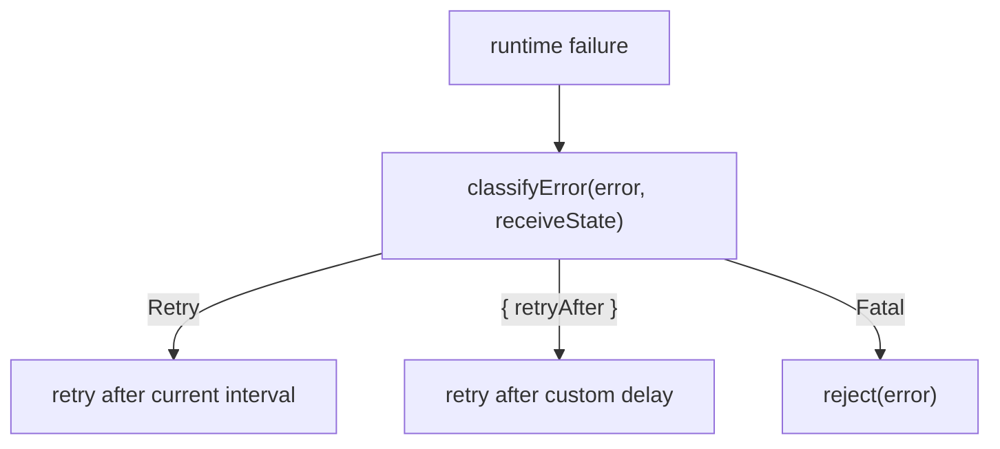
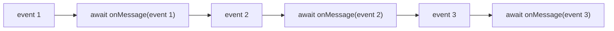
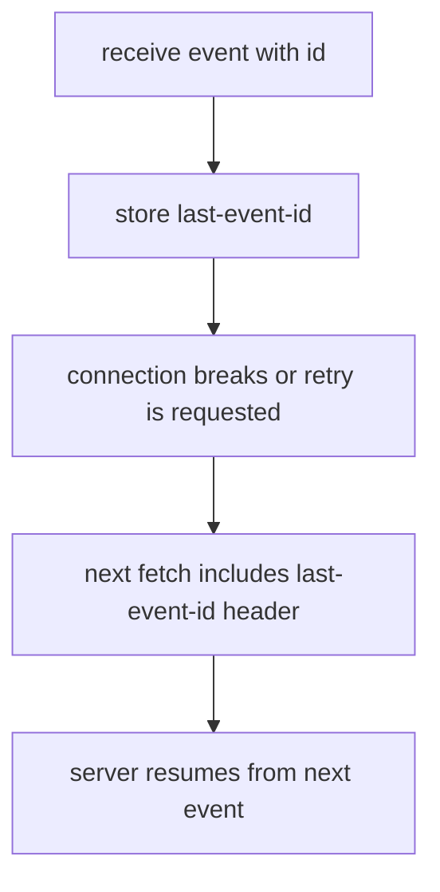

# modern-fetch-stream

[](https://www.npmjs.com/package/modern-fetch-stream)
[](https://www.npmjs.com/package/modern-fetch-stream)
[](https://bundlephobia.com/package/modern-fetch-stream)
[](https://github.com/AIEPhoenix/modern-fetch-stream/blob/main/LICENSE)
[](https://www.typescriptlang.org/)

A lightweight Server-Sent Events client built on the Fetch API with automatic reconnection, `last-event-id` tracking, and explicit response / error classification.

SSE parsing is delegated to the spec-compliant [`eventsource-parser`](https://github.com/rexxars/eventsource-parser).

## Why

The native [`EventSource`](https://developer.mozilla.org/en-US/docs/Web/API/EventSource) API is limited: GET only, no custom headers, no request body, and very little control over retry strategy.

`modern-fetch-stream` keeps the good parts of fetch-based SSE clients while making retry semantics explicit:

- **Use `fetch` directly** for POST requests, custom headers, and request bodies.
- **Classify responses separately from runtime errors** with `classifyResponse` and `classifyError`.
- **Throw `FatalError` / `RetriableError`** when you want the library to handle retry semantics for you.
- **Run anywhere `fetch` exists**: browsers, Node.js 18+, Bun, and Deno.

## Install

```bash
npm install modern-fetch-stream
```

## 1.0.0 breaking changes

`1.0.0` is a breaking release. The main API changes are:

- `onerror` is removed. Retry/fatal decisions now live in `classifyResponse` and `classifyError`.
- Lifecycle callbacks are now `onOpen`, `onMessage`, and `onClose`.
- `onMessage` can be async and is awaited serially.
- The default response policy now accepts only `2xx` `text/event-stream` responses.

## Quick start

```ts
import {
  FatalError,
  FetchEventSourceDecision,
  RetriableError,
  fetchEventSource,
} from 'modern-fetch-stream'

await fetchEventSource('/api/chat', {
  method: 'POST',
  headers: {
    'Content-Type': 'application/json',
    Authorization: 'Bearer sk-...',
  },
  body: JSON.stringify({ prompt: 'Hello' }),

  classifyResponse(response) {
    if (response.ok) return FetchEventSourceDecision.Accept

    if (response.status >= 400 && response.status < 500 && response.status !== 429) {
      return FetchEventSourceDecision.Fatal
    }

    return FetchEventSourceDecision.Retry
  },

  onOpen(response) {
    console.log('stream opened', response.status)
  },

  onMessage(event) {
    console.log(event.data)
  },

  onClose(close) {
    console.log('stream closed', close.reason, close.receiveState)
  },

  classifyError(error) {
    if (error instanceof FatalError) return FetchEventSourceDecision.Fatal
    if (error instanceof RetriableError) return { retryAfter: error.retryAfter ?? 1000 }
    return FetchEventSourceDecision.Retry
  },
})
```

## Migration from 0.x

If you used the pre-`1.0.0` API, the main mapping is:

| Before | Now |
|--------|-----|
| `onopen(response)` to validate the response | `classifyResponse(response)` to decide `Accept / Retry / Fatal`, then `onOpen(response)` for side effects |
| `onmessage(event)` | `onMessage(event)` |
| `onclose()` | `onClose({ reason, receiveState })` |
| `onerror(error)` returning a retry interval | `classifyError(error, receiveState)` returning `Retry`, `Fatal`, or `{ retryAfter }` |

## API

### `fetchEventSource(input, init): Promise<void>`

| Parameter | Type | Description |
|-----------|------|-------------|
| `input` | `RequestInfo \| URL` | The resource to fetch. |
| `init` | `FetchEventSourceInit` | Fetch options extended with SSE callbacks and classifiers. |

At a high level, the library has three phases:

1. classify the HTTP response
2. consume SSE messages
3. either close or retry



### `FetchEventSourceInit`

Extends the standard [`RequestInit`](https://developer.mozilla.org/en-US/docs/Web/API/RequestInit) with the following:

| Option | Type | Default | Description |
|--------|------|---------|-------------|
| `headers` | `Record<string, string>` | `{}` | Request headers. `accept: text/event-stream` is added automatically. |
| `fetch` | `typeof fetch` | `globalThis.fetch` | Custom fetch implementation. |
| `openWhenHidden` | `boolean` | `false` | Keep the connection alive when the page is hidden. |
| `classifyResponse` | `(response) => ResponseDecision` | Accept only `2xx` `text/event-stream` responses | Decides whether a newly received response should be accepted, retried, or treated as fatal. |
| `onOpen` | `(response) => void \| Promise<void>` | — | Called after `classifyResponse` accepts the response and before the body is consumed. |
| `onMessage` | `(event) => void \| Promise<void>` | — | Called for every SSE message, including custom event types. Async handlers are awaited serially. |
| `onClose` | `({ reason, receiveState }) => void \| Promise<void>` | — | Called when the SSE request closes. `reason` is `eof` for stream completion and `aborted` for external cancellation. Throwing on `eof` routes through `classifyError`; throwing on `aborted` rejects directly. |
| `classifyError` | `(error, receiveState) => ErrorDecision` | Retry generic errors; fatal for `ResponseError` / `FatalError`; retry for `RetriableError` | Decides whether an error should be retried or treated as fatal. |

### Execution order

On a successful stream, the callbacks run in this order:

```text
classifyResponse -> onOpen -> onMessage... -> onClose({ reason: "eof" })
```

If any of these throw or reject, the error is routed through `classifyError`.

External abort follows this path:

```text
AbortSignal -> onClose({ reason: "aborted" }) -> resolve
```

If `onClose({ reason: "aborted" })` throws or rejects, the returned promise rejects directly instead of calling `classifyError`.

Successful completion timeline:



Abort timeline:



### Error classes

The library exports four error classes:

```ts
import {
  FetchEventSourceError,
  ResponseError,
  FatalError,
  RetriableError,
} from 'modern-fetch-stream'
```

- `FetchEventSourceError`: base class for library-defined errors.
- `ResponseError`: wraps a rejected HTTP response and exposes `response`.
- `FatalError`: default fatal classification.
- `RetriableError`: default retriable classification and optional `retryAfter`.

### Other exports

```ts
import {
  EventStreamContentType,
  FetchEventSourceCloseReason,
  FetchEventSourceDecision,
  ReceiveState,
} from 'modern-fetch-stream'
```

- `EventStreamContentType`: the standard `text/event-stream` MIME type.
- `FetchEventSourceCloseReason`: runtime close-reason constants for `Eof` and `Aborted`.
- `FetchEventSourceDecision`: runtime decision constants for `Accept`, `Retry`, and `Fatal`.
- `ReceiveState`: final stream receive state passed to `onClose` and `classifyError`.

### Decision constants

```ts
import { FetchEventSourceCloseReason, FetchEventSourceDecision } from 'modern-fetch-stream'

FetchEventSourceDecision.Accept // "accept"
FetchEventSourceDecision.Retry  // "retry"
FetchEventSourceDecision.Fatal  // "fatal"

FetchEventSourceCloseReason.Eof     // "eof"
FetchEventSourceCloseReason.Aborted // "aborted"
```

```ts
type ErrorDecision =
  | typeof FetchEventSourceDecision.Retry
  | typeof FetchEventSourceDecision.Fatal
  | { retryAfter: number }

type ResponseDecision =
  | typeof FetchEventSourceDecision.Accept
  | ErrorDecision
```

### ReceiveState

```ts
ReceiveState.IDLE
ReceiveState.RECEIVED
ReceiveState.RECEIVED_NO_ID
```

- `IDLE`: the stream closed before any message was received.
- `RECEIVED`: at least one message with an `id` was received and `last-event-id` is available.
- `RECEIVED_NO_ID`: messages were received, but there is no resumable `last-event-id`.

## Response classification

Use `classifyResponse` when retry policy depends on the HTTP response itself:

```ts
await fetchEventSource('/api/stream', {
  classifyResponse(response) {
    if (response.ok) return FetchEventSourceDecision.Accept

    if (response.status === 429) {
      return { retryAfter: 5000 }
    }

    if (response.status >= 400 && response.status < 500) {
      return FetchEventSourceDecision.Fatal
    }

    return FetchEventSourceDecision.Retry
  },
})
```

If `classifyResponse` returns `Retry`, `Fatal`, or `{ retryAfter }`, the current response is discarded immediately. Rejected responses become `ResponseError` instances when they terminate the stream.



## Error classification

Use `classifyError` when retry policy depends on runtime failures or exceptions thrown or rejected inside callbacks:

```ts
await fetchEventSource('/api/stream', {
  onClose(close) {
    if (close.reason === FetchEventSourceCloseReason.Eof) {
      throw new RetriableError('server closed early', 250)
    }
  },

  classifyError(error, receiveState) {
    if (receiveState === 'IDLE') {
      return { retryAfter: 2000 }
    }

    if (error instanceof FatalError) {
      return FetchEventSourceDecision.Fatal
    }

    return FetchEventSourceDecision.Retry
  },
})
```

If you omit `classifyError`, the defaults are:

- `ResponseError` -> fatal
- `FatalError` -> fatal
- `RetriableError` -> retry, using `retryAfter` when provided
- every other error -> retry

`classifyError` is only used for runtime failures. If `classifyResponse` directly returns `Fatal` or `Retry`, that decision is applied without calling `classifyError`.

External aborts are treated as normal shutdown: the returned promise resolves after `onClose({ reason: "aborted" })`. If that aborted close handler throws, the promise rejects directly.



## Message handling and backpressure

`onMessage` is awaited serially. This means:

- messages are processed in order
- rejected async handlers flow into `classifyError`
- slow handlers apply backpressure to the stream

If you want fire-and-forget work, do it explicitly:

```ts
onMessage(event) {
  void processLater(event)
}
```



## Reconnection

On each retry the library automatically sends the `last-event-id` header with the id of the most recently received message, allowing the server to resume from where it left off.

The server can also control the retry interval by including a `retry` field in the event stream:

```text
retry: 3000
data: hello
```

If your own `classifyError` or `RetriableError` does not specify `retryAfter`, the latest server-provided retry interval is used.

The library does not impose a built-in max retry count. If you want limits such as `maxRetries`, track that state outside the library and return `FetchEventSourceDecision.Fatal` when your policy is exhausted.



## Page visibility

In browsers, the connection is closed when the page becomes hidden and re-established when it becomes visible again. Set `openWhenHidden: true` to disable this behavior.

This feature is skipped automatically in non-browser environments.

Visibility-driven internal aborts do not surface as `reason: "aborted"`. That close reason is reserved for caller-controlled cancellation via `AbortSignal`.

## Request input support

`fetchEventSource` accepts a URL, `Request`, or `URL` object. When you pass a `Request`, its headers and signal are preserved and merged with the explicit `init` options. The library normalizes header names to lowercase so it can safely manage `accept` and `last-event-id`.

## License

MIT
