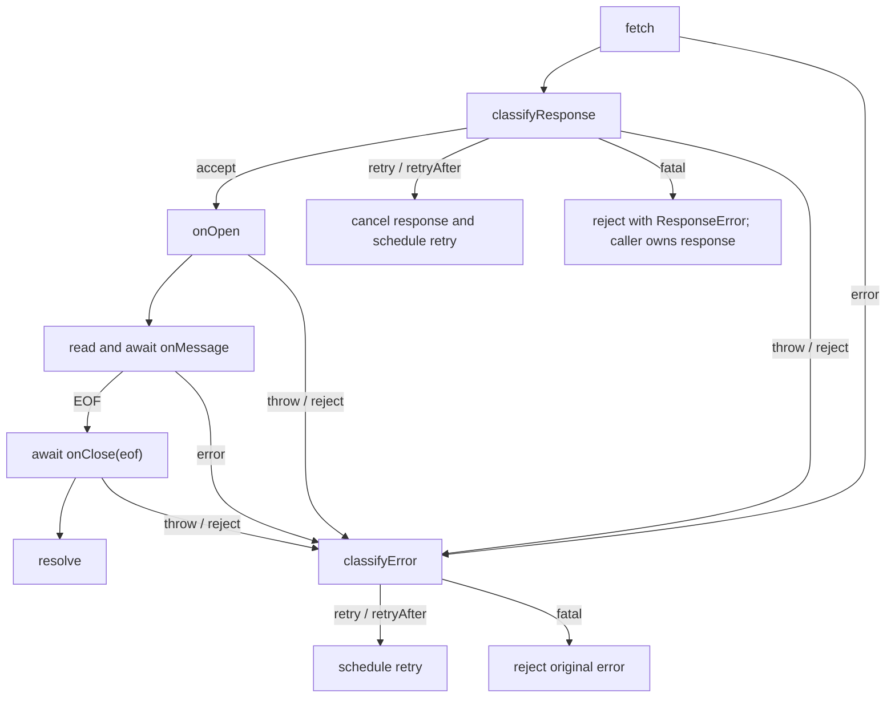

# modern-fetch-stream

[](https://www.npmjs.com/package/modern-fetch-stream)
[](https://www.npmjs.com/package/modern-fetch-stream)
[](https://bundlephobia.com/package/modern-fetch-stream)
[](https://github.com/AIEPhoenix/modern-fetch-stream/blob/main/LICENSE)
[](https://www.typescriptlang.org/)

A fetch-based Server-Sent Events (SSE) client with POST support, custom headers, configurable retries, and `last-event-id` tracking. Parsing is handled by [`eventsource-parser`](https://github.com/rexxars/eventsource-parser).

> This README describes version 1.0.3. See the [changelog](https://github.com/AIEPhoenix/modern-fetch-stream/blob/main/CHANGELOG.md#103---2026-10-08) for the fixes and additions in this release.

## Install

```sh
npm install modern-fetch-stream
```

The package provides ESM and CommonJS entry points with TypeScript declarations.

### Runtime requirements

The client uses the Fetch and Web Streams APIs: `fetch`, `Request`, `Headers`, `AbortController`, `ReadableStream`, `TransformStream`, and `TextDecoderStream`. A custom `fetch` must return a compatible `Response` with a Web `ReadableStream` body; providing `fetch` alone does not supply the other globals.

CI covers Node.js 18, 20, 22, and 24. Browsers, Bun, and Deno need the same APIs; they are not currently covered by the CI matrix. The examples below use browser-relative URLs. In Node.js, use an absolute URL such as `http://localhost:3000/api/stream`.

## Quick start

```ts
import { fetchEventSource } from 'modern-fetch-stream'

await fetchEventSource('/api/chat', {
  method: 'POST',
  headers: { 'content-type': 'application/json' },
  body: JSON.stringify({ prompt: 'Hello' }),

  onMessage(event) {
    console.log(event.data)
  },

  onClose({ reason, receiveState }) {
    console.log('stream closed', reason, receiveState)
  },
})
```

With the default policy:

- A response is accepted only when its status is `2xx` and its media type is `text/event-stream`. Parameters such as `charset=utf-8` are allowed. An accepted response must also have a body.
- Other HTTP responses reject with `ResponseError`, including `429` and `5xx`. To retry those responses, provide `classifyResponse`.
- Ordinary network and callback errors retry after 1,000 ms, or the latest server-sent `retry:` interval. `FatalError` and `ResponseError` stop retries.
- Normal EOF calls `onClose({ reason: 'eof', receiveState })` and resolves. **EOF does not reconnect automatically.**
- In a browser, a hidden page pauses the connection. Use `openWhenHidden: true` to keep it open.

## API

### `fetchEventSource(input, init): Promise<void>`

| Parameter | Type | Description |
|-----------|------|-------------|
| `input` | `RequestInfo \| URL` | A URL string, `URL`, or `Request`. |
| `init` | `FetchEventSourceInit` | Optional fetch options, callbacks, and classifiers. Defaults to `{}`. |

The promise represents the entire operation, including retries. It resolves on normal EOF or caller cancellation. Fatal decisions, invalid inputs, and failures in the error classifier or abort-close callback can reject it. See [cancellation](#cancellation) for abort callback behavior and [request bodies](#request-bodies-and-retries) for replay limits.

### `FetchEventSourceInit`

Extends `RequestInit`. Standard options such as `method`, `body`, `credentials`, and `signal` are forwarded to the request, with headers and signals handled as described below.

| Option | Type | Behavior |
|--------|------|----------|
| `headers` | `HeadersInit` | Accepts a record, `Headers`, or tuple array. Copied and normalized; adds `accept: text/event-stream` when no non-empty Accept value is supplied. |
| `fetch` | `typeof globalThis.fetch` | Defaults to `globalThis.fetch`. |
| `openWhenHidden` | `boolean` | Defaults to `false`; pauses while the browser page is hidden. |
| `classifyResponse` | `(response: Response) => ResponseDecision \| Promise<ResponseDecision>` | Accept, retry, or reject the HTTP response before reading its body. |
| `onOpen` | `(response: Response) => void \| Promise<void>` | Runs after acceptance, before the library reads the body. Leave the body unread and unlocked for the SSE reader. |
| `onMessage` | `(event: EventSourceMessage) => void \| Promise<void>` | Receives every parsed message, including custom event types. Async handlers run serially. |
| `onClose` | `(close: FetchEventSourceClose) => void \| Promise<void>` | Runs on normal EOF or caller cancellation, at most once per attempt. |
| `classifyError` | `(error: unknown, receiveState: ReceiveState) => ErrorDecision \| Promise<ErrorDecision>` | Decides whether a runtime or callback error should retry or reject. |

### Execution order

```text
fetch → classifyResponse → onOpen → onMessage… → onClose({ reason: 'eof', receiveState })
```

Both classifiers and all lifecycle callbacks may be async. A custom classifier replaces the corresponding default policy.


```mermaid
flowchart TD
    A["fetch"] --> B["classifyResponse"]
    B -->|"accept"| C["onOpen"]
    B -->|"retry / retryAfter"| D["cancel response and schedule retry"]
    B -->|"fatal"| E["reject with ResponseError; caller owns response"]
    C --> F["read and await onMessage"]
    F -->|"EOF"| G["await onClose(eof)"]
    G --> H["resolve"]
    A -->|"error"| I["classifyError"]
    B -->|"throw / reject"| I
    C -->|"throw / reject"| I
    F -->|"error"| I
    G -->|"throw / reject"| I
    I -->|"retry / retryAfter"| J["schedule retry"]
    I -->|"fatal"| K["reject original error"]
```

`onClose` is not a general cleanup hook: fatal responses, runtime failures, and visibility pauses do not call it. Use `try` / `finally` around the returned promise for application cleanup that must run on every terminal outcome.

### Decisions and close reasons

```ts
import {
  FetchEventSourceDecision,
  FetchEventSourceCloseReason,
} from 'modern-fetch-stream'

FetchEventSourceDecision.Accept // 'accept': response classifier only
FetchEventSourceDecision.Retry  // 'retry': use the current interval
FetchEventSourceDecision.Fatal  // 'fatal': reject

FetchEventSourceCloseReason.Eof     // 'eof': response body ended normally
FetchEventSourceCloseReason.Aborted // 'aborted': caller cancelled
```

`ErrorDecision` is `'retry' | 'fatal' | { retryAfter: number }`. `ResponseDecision` also allows `'accept'`.

`retryAfter` is a finite, non-negative number of milliseconds; `0` schedules a retry without an added delay. It overrides only the next retry, without changing the remembered server interval. Keep delays within the host runtime's timer range.

### ReceiveState

The state resets for each connection attempt and is passed to `onClose` and `classifyError`:

| Value | Meaning for the current attempt |
|-------|---------------------------------|
| `ReceiveState.IDLE` | No message has reached the read loop yet. |
| `ReceiveState.RECEIVED` | A message supplied a non-empty `id`, and no later message explicitly cleared it. |
| `ReceiveState.RECEIVED_NO_ID` | Messages arrived without establishing a non-empty ID in this attempt, or a later message cleared that ID. |

This state describes delivery to the callback, not successful application processing. It is updated before `onMessage` runs. It also does not fully describe the stored resume header: an ID supplied in request headers or retained from an earlier attempt can still be sent when the current state is `IDLE` or `RECEIVED_NO_ID`.

### Error classes

The package exports the abstract base class `FetchEventSourceError` and three concrete subclasses:

| Class | `code` | Behavior |
|-------|--------|----------|
| `ResponseError` | `RESPONSE_ERROR` | Wraps a response rejected by the response classifier; available as `error.response`. |
| `FatalError` | `FATAL_ERROR` | Stops retries under the default error policy. |
| `RetriableError` | `RETRIABLE_ERROR` | Requests a retry under the default error policy; accepts an optional `retryAfter` in milliseconds. |

All inherit from `Error`. A custom `classifyError` controls how errors thrown by callbacks are handled, including these subclasses.

## Response classification

This example retries `429` and `5xx` while keeping the default status and media type checks for accepted responses:

```ts
import {
  EventStreamContentType,
  FetchEventSourceDecision,
  fetchEventSource,
} from 'modern-fetch-stream'

await fetchEventSource('/api/stream', {
  classifyResponse(response) {
    if (response.status === 429) return { retryAfter: 5000 }
    if (response.status >= 500) return FetchEventSourceDecision.Retry

    const mediaType = response.headers.get('content-type')
      ?.split(';', 1)[0].trim().toLowerCase()

    return response.ok && mediaType === EventStreamContentType
      ? FetchEventSourceDecision.Accept
      : FetchEventSourceDecision.Fatal
  },
})
```

A response retry cancels the body before scheduling another attempt. A fatal response rejects directly with `ResponseError`, without calling `classifyError` or `onClose`. Its body remains available unless your classifier already consumed or cancelled it. The caller must consume or cancel that body:

```ts
import { ResponseError, fetchEventSource } from 'modern-fetch-stream'

try {
  await fetchEventSource('/api/stream')
} catch (error) {
  if (error instanceof ResponseError) {
    console.error(error.response.status, await error.response.text())
  } else {
    throw error
  }
}
```

Use `await error.response.body?.cancel()` when the error payload is not needed. A custom classifier must leave accepted bodies unread and unlocked. Throwing from the classifier sends the error to `classifyError`; it does not preserve the response for the caller.

## Error classification

The default policy is:

| Error | Decision |
|-------|----------|
| `FatalError` or `ResponseError` | Reject with that error. |
| `RetriableError` with `retryAfter` | Retry after that delay. |
| Other errors, including `RetriableError` without a delay | Retry using the current interval. |

To reconnect after EOF, throw from `onClose` only when the close reason is `eof`:

```ts
import {
  FetchEventSourceCloseReason,
  RetriableError,
  fetchEventSource,
} from 'modern-fetch-stream'

await fetchEventSource('/api/stream', {
  onClose({ reason }) {
    if (reason === FetchEventSourceCloseReason.Eof) {
      throw new RetriableError('Reconnect after EOF')
    }
  },
})
```

To customize runtime retries while preserving fatal errors and explicit retry delays:

```ts
import {
  FatalError,
  FetchEventSourceDecision,
  ReceiveState,
  ResponseError,
  RetriableError,
  fetchEventSource,
} from 'modern-fetch-stream'

await fetchEventSource('/api/stream', {
  classifyError(error, receiveState) {
    if (error instanceof FatalError || error instanceof ResponseError) {
      return FetchEventSourceDecision.Fatal
    }
    if (error instanceof RetriableError) {
      return error.retryAfter === undefined
        ? FetchEventSourceDecision.Retry
        : { retryAfter: error.retryAfter }
    }
    return receiveState === ReceiveState.IDLE
      ? { retryAfter: 2000 }
      : FetchEventSourceDecision.Retry
  },
})
```

If `classifyError` itself throws, rejects, or returns an invalid delay, the operation rejects; the error is not classified again. An invalid delay from `classifyResponse` instead enters `classifyError` as a `TypeError`.

## Cancellation

```ts
import { fetchEventSource } from 'modern-fetch-stream'

const controller = new AbortController()
const task = fetchEventSource('/api/stream', {
  signal: controller.signal,
  onMessage(event) { console.log(event.data) },
})

controller.abort() // For example, when the user leaves the view.
await task
```

Caller cancellation stops retries and message delivery. It normally calls `onClose({ reason: 'aborted', receiveState })`, awaits that callback, and resolves. If this callback throws or rejects, the operation rejects directly without calling `classifyError`.

`onClose` runs at most once per attempt. If it has already started for EOF, a later abort resolves without invoking it again or waiting for that existing callback to finish. This also applies when an EOF callback threw and the operation is waiting to retry.

An already-aborted signal closes without sending a request. `signal: null` adds no explicit cancellation signal. Aborting cannot interrupt application code already running inside a callback; the operation may settle while that callback is still pending. Make long-running callback work cancellation-aware when needed.

## Message handling and backpressure

The client awaits each `onMessage` before delivering the next message. This preserves callback order and slows further consumption when a handler is busy. Decoding and parsing may still buffer data, including multiple events from one incoming chunk; this is not a fixed memory bound.

Await application work in the handler when its failures should reach `classifyError`. Work started without awaiting it needs its own error handling. Caller cancellation suppresses further message callbacks but does not roll back work already performed.

## Reconnection

The initial retry interval is 1,000 ms. A server-sent `retry:` field replaces that interval, and the value persists across reconnections:

```text
retry: 3000
data: hello

```

A `{ retryAfter }` decision or `RetriableError` delay overrides the next retry only. There is no automatic exponential backoff, jitter, retry limit, or `Retry-After` HTTP header handling. Implement the desired policy in the classifiers. To cap retries across both HTTP and runtime failures, share a counter between both classifiers.

### Resume IDs

The client updates the `last-event-id` header from messages delivered by the parser:

- A non-empty `id` replaces the stored value.
- An empty `id` clears it.
- A message without an `id` leaves the stored value unchanged.

The header is retained across attempts so a cooperating server can resume delivery. It is updated **before** `onMessage` finishes, so it is not an acknowledgement of successful processing. If the handler fails and a retry follows, the server may resume after that event. The library does not guarantee application-level replay or exactly-once processing.

### Request bodies and retries

For reconnecting requests, use a URL with a reusable `init.body`, such as a string, `Blob`, `FormData`, `URLSearchParams`, or byte buffer:

```ts
import { fetchEventSource } from 'modern-fetch-stream'

await fetchEventSource('/api/stream', {
  method: 'POST',
  headers: { 'content-type': 'application/json' },
  body: JSON.stringify({ prompt: 'Hello' }),
})
```

An inherited `Request` body or an explicit `ReadableStream` is a one-shot input. The first attempt is supported; a later attempt, including one triggered by a visibility pause, rejects with `FatalError` before sending again. This rejection bypasses `classifyError`. An explicit reusable `init.body` can replace the inherited body and allow retries.

The client does not buffer or clone streaming uploads and does not accept a request factory. For a fresh stream on every attempt, manage separate calls in application code. Set `openWhenHidden: true` if a one-shot request should continue while the page is hidden.

Retries resend the request. For operations with side effects, ensure the server can safely handle repeated requests, for example with an idempotency key. Keep reusable bodies unchanged until the operation finishes.

## Page visibility

With the default `openWhenHidden: false`:

- If the page starts hidden, the first request waits until it becomes visible.
- Hiding the page cancels the active request and pending retry timer.
- Becoming visible requests a new connection without waiting out the old retry delay. If a callback from the previous attempt is still pending, the next attempt waits for it to settle.

Visibility pauses do not call `onClose` or settle the operation. Completed or cancelled operations do not restart on a visibility change. Set `openWhenHidden: true` to disable this behavior. It is skipped in environments without browser document events.

## Request input support

When `input` is a `Request`:

- Its headers are copied first. Explicit `init.headers` then override matching names; they do not replace the entire header set.
- Header names are normalized to lowercase. The input headers are not mutated.
- Its signal and an explicit `init.signal` are both respected. Either can cancel the operation, even though native fetch receives an internal per-attempt signal.
- Other options follow the underlying fetch implementation's `Request` / `RequestInit` behavior. See [request body replay limits](#request-bodies-and-retries).

## Type exports

The package exports `EventStreamContentType`, the decision and close-reason constants, `ReceiveState`, the error classes, and `fetchEventSource` as runtime values. The public types are:

```ts
import type {
  ErrorDecision,
  ResponseDecision,
  EventSourceMessage,
  FetchEventSourceClose,
  FetchEventSourceInit,
  FetchEventSourceDecisionValue,
  FetchEventSourceCloseReasonValue,
} from 'modern-fetch-stream'
```

`EventSourceMessage` is re-exported from `eventsource-parser`. It contains `data` and optional `event` and `id` fields. `FetchEventSourceClose` contains `reason` and `receiveState`.

## Migration from 0.x

Version 1.0.0 introduced these breaking changes:

| Before | Now |
|--------|-----|
| `onopen(response)` for response validation | `classifyResponse(response)` for acceptance and retry decisions; `onOpen(response)` for side effects. |
| `onmessage(event)` | `onMessage(event)`, with serial async handling. |
| `onclose()` | `onClose({ reason, receiveState })`. |
| `onerror(error)` returning a delay | `classifyError(error, receiveState)` returning `Retry`, `Fatal`, or `{ retryAfter }`. |

The default response policy accepts only `2xx` responses with the `text/event-stream` media type. See the [changelog](https://github.com/AIEPhoenix/modern-fetch-stream/blob/main/CHANGELOG.md) for subsequent fixes and unreleased changes.

## Development checks

```sh
npm ci
npm ci --prefix test-server
npm run verify
```

| Command | Checks |
|---------|--------|
| `npm run check` | Type-checks `src/`. |
| `npm test` | Runs Vitest tests, including local HTTP tests with native fetch. |
| `npm run test:e2e` | Starts a local Hono server and runs integration tests. Requires the dependencies in `test-server/`. |
| `npm run test:all` | Runs Vitest and Hono integration tests. |
| `npm run test:package` | Builds and packs the package, installs it in a temporary consumer, and checks ESM/CJS runtime and TypeScript imports. Requires registry access for installation. |
| `npm run verify` | Runs type checks, both test suites, and package checks. |

`npm pack` and `npm publish` rebuild `dist` through `prepack` unless lifecycle scripts are disabled. They do not run the full test suite automatically; run `npm run verify` before publishing. CI runs `verify` on Node.js 18, 20, 22, and 24.

## License

[MIT](https://github.com/AIEPhoenix/modern-fetch-stream/blob/main/LICENSE)
